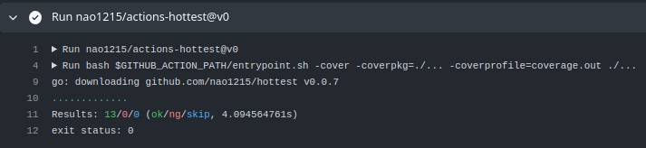
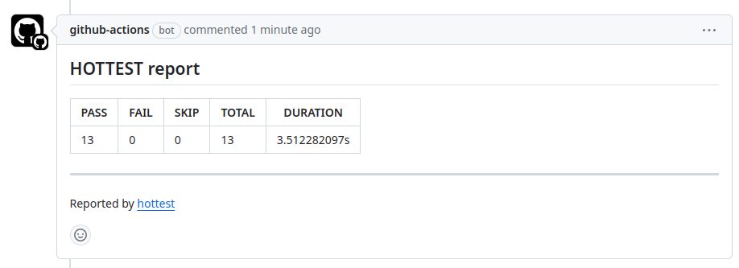
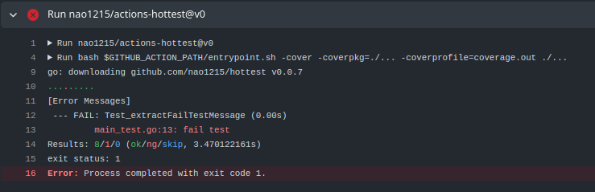
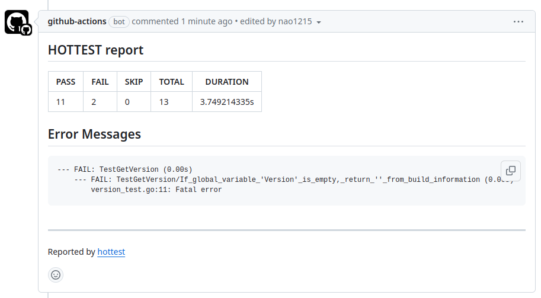

[](https://github.com/nao1215/hottest/actions/workflows/linux_test.yml)
[](https://github.com/nao1215/hottest/actions/workflows/mac_test.yml)
[](https://github.com/nao1215/hottest/actions/workflows/windows_test.yml)
[](https://github.com/nao1215/hottest/actions/workflows/reviewdog.yml)

[](https://goreportcard.com/report/github.com/nao1215/hottest)
## What is hottest ?
The hottest part in unit testing is the **error messages**.
  
The `hottest` command extracts error messages from the unit test logs, saving the effort of searching for error messages.  It's usage is the same as the `go test` command. 


The `hottest` command is the wrapper for 'go test'. It adds the "-v" option to the 'go test' options provided by the user and executes the tests. Successful test results are represented by green ".", while failed tests are represented by red ".".
  
Upon completion of the tests, it displays information about the failed tests and summarizes the test results.


## Installation
```bash
go install github.com/nao1215/hottest@latest
```

## Usage
```bash
Usage:
  hottest [arguments]
          ※ The arguments are the same as 'go test'.
Example:
  hottest -cover ./... -coverprofile=cover.out
```

### CLI example
Example:
```bash
$ hottest ./...
...............................................................
[Error Messages]
 --- FAIL: TestPlainText (0.00s)
     --- FAIL: TestPlainText/success_PlainText() (0.00s)
         markdown_test.go:25: value is mismatch (-want +got):
               []string{
             -  "Hllo",
             +  "Hello",
               }
Results: 61/2/0 (ok/ng/skip, 242.172244ms, by hottest v0.0.2)
```

### On GitHub Actions
:octocat: GitHub Actions for hottest is available at [nao1215/actions-hottest](https://github.com/nao1215/actions-hottest)

Sample workflow:
```yml
name: SampleTest

on:
  push:

jobs:
  sample_test:
    name: sample test

    strategy:
      matrix:
        platform: [ubuntu-latest]

    runs-on: ${{ matrix.platform }}

    steps:
      - uses: actions/checkout@v4

      - uses: actions/setup-go@v4
        with:
          go-version: "1"
          check-latest: true

      - name: Download dependencies
        run: go mod download

      - uses: nao1215/actions-hottest@v1
        with:
          # This argument is same as `go test` command.
          args: '-cover -coverpkg=./... -coverprofile=coverage.out ./...'
```

- Set `args` argument same as `go test` command.  
- `nao1215/actions-hottest` requires the permission to comment on pull requests in order to store test results as PR comments. Please enable the following settings:
  - [GitHub Repository Top Page] -> [Settings] -> [Actions] -> [General] -> [Read and write permissions] = ON
- The old PR comments created by `hottest` will be deleted when creating a new PR comment.

> [!IMPORTANT]  
> Please remember to include 'go mod download' in the workflow. If you forget, the hottest command may experience long waiting times when running tests, and the tests may not complete.
  
#### Success case



#### Failure case



## Alternative tools
- [rakyll/gotest](https://github.com/rakyll/gotest): go test with colors
- [kyoh86/richgo](https://github.com/kyoh86/richgo): Enrich `go test` outputs with text decorations.
- [gotestyourself/gotestsum](https://github.com/gotestyourself/gotestsum): 'go test' runner with output optimized for humans, JUnit XML for CI integration, and a summary of the test results.

## Hottest does not get coverage
I considered adding a feature to aggregate coverage information during the development of `hottest`. However, I have decided that it is better to use the excellent coverage aggregation functionality provided by [k1LoW/octocov](https://github.com/k1LoW/octocov). Therefore, `hottest` will not add any features related to coverage.

## Contributing
First off, thanks for taking the time to contribute! If you feel that the hottest command is not working properly, please let me know by sending me `go test -v . /... -json` log please.
  
Contributions are not only related to development. For example, GitHub Star motivates me to develop!
[](https://star-history.com/#nao1215/hottest&Date)


## LICENSE
[BSD 3-Clause License](./LICENSE)
  
Some portions of the code in this file were forked from [rakyll/gotest](https://github.com/rakyll/gotest). The `gotest` is licensed under the BSD 3-Clause "New" or "Revised" License. Full license text is available in [main.go](./main.go)

## Origin of the Name
The `hottest` is a command developed with inspiration from [rakyll/gotest](https://github.com/rakyll/gotest). While `gotest` adds color to error logs, as the volume of unit tests increases, it becomes challenging to locate error messages with color alone.

To solve this issue, the idea emerged to make a slight improvement to `gotest`, leading to the development of `hottest`. Advancing just one step from 'g' takes you to 'h'.   
  
I liked "hotest," but to avoid being corrected for a spelling mistake, I chose "hottest."
